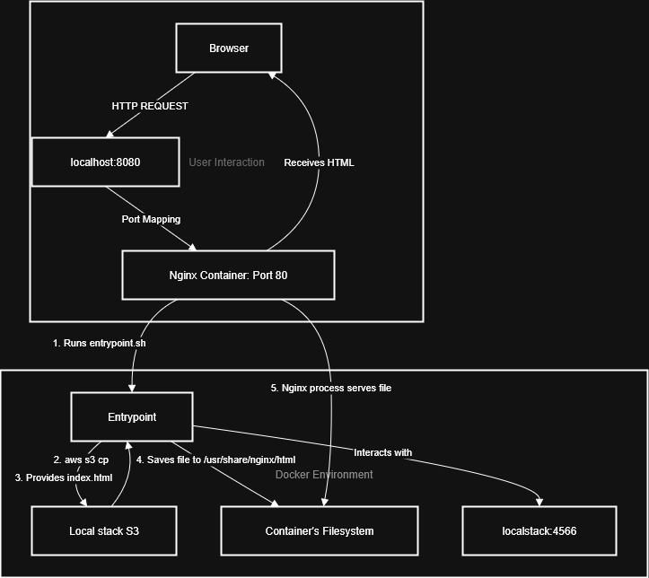

# Mini Project 1: Multi-Pattern Containerized Web Server Deployment

This project demonstrates foundational DevOps principles by deploying an Nginx web server using three distinct, progressively complex patterns. It uses Docker, Docker Compose, Python, and LocalStack to simulate a real-world cloud environment on a local machine, showcasing a journey from basic containerization to advanced, programmatic automation.

---

## Core Concepts Demonstrated

*   **Infrastructure as Code (IaC):** Implemented both **declarative** (Docker Compose) and **imperative** (Python script) approaches, highlighting the trade-offs of each.
*   **Containerization & Orchestration:** Created custom, multi-stage Docker images and managed a multi-container application stack with Docker Compose.
*   **Cloud Services Simulation:** Leveraged LocalStack to mimic AWS S3 for dynamic content hosting, enabling development and testing of cloud-native patterns without an AWS account.
*   **Automation & Scripting:** Developed a Python script using the Docker SDK (`docker-py`) to programmatically manage the entire application lifecycle, from network creation to container provisioning and cleanup.
*   **Decoupled Architecture:** Refactored a monolithic application into a dynamic system where the web server fetches its content from an object store (S3) on startup via a custom entrypoint script.
*   **Configuration Management:** Utilized environment variables to pass configuration (API endpoints, credentials, bucket names) into containers, following Twelve-Factor App principles.
*   **Container Networking:** Configured service-to-service communication between containers on a user-defined Docker network.

---

## Technologies Used

*   **Containerization:** Docker, Docker Compose
*   **Cloud (Simulated):** LocalStack (emulating AWS S3)
*   **Automation:** Python 3, Docker SDK (`docker-py`), Bash Scripting
*   **Web Server:** Nginx
*   **CLI Tools:** AWS CLI

---

## Project Structure & How to Run

This repository is divided into three parts, each located in its own directory and representing a different deployment pattern.

### Part 1: Basic Declarative Deployment
A simple, self-contained Nginx deployment where the website content is built directly into the Docker image.

**To Run:**
````bash
cd part1-declarative-basic
docker-compose up -d
````
Access the site at http://localhost:8080

### Part 2: Dynamic Declarative Deployment
An advanced pattern where the Nginx container is generic and dynamically fetches its index.html file from a LocalStack S3 bucket on startup.

**To Run:**
#### First, start LocalStack and provision the S3 bucket
```bash 
cd part2-declarative-dynamic
docker-compose up -d localstack
```

#### Use the AWS CLI to create the bucket and upload the content
<i>__Note: Ensure you have dummy AWS credentials configured for the CLI.__</i>
```bash
aws --endpoint-url=http://localhost:4566 s3 mb s3://my-dynamic-website-bucket
aws --endpoint-url=http://localhost:4566 s3 cp ./nginx-web/index.html s3://my-dynamic-website-bucket/
```
#### Now, start the web server, which will pull its content from S3.
```bash
docker-compose up -d nginx-service
```
Access the site at http://localhost:8080

### Part 3: Imperative Deployment with Python
A Python script that uses the Docker SDK to build the entire environment from scratch. This script handles network creation, container provisioning (installing Nginx inside a bare Ubuntu container), and deployment.
**To Run:**
``` bash 
cd part3-imperative-python
```
#### Install the required Python library
```bash
pip install docker
```
#### Run the deployment script
```bash
python3 deploy.py
```
Access the site at http://localhost:8081.

#### To clean up, 
```bash
run python3 cleanup.py.
```

### Architectural Diagram (Part 2: Dynamic Deployment)
This diagram illustrates the dynamic content flow, where the Nginx container is decoupled from its content.



## License
This project is licensed under the MIT License - see the [LICENSE](LICENSE) file for details.